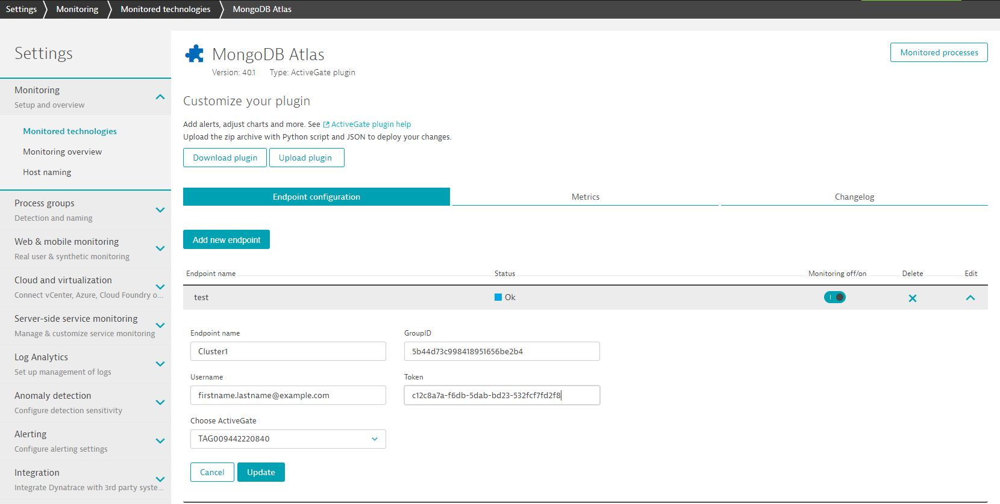
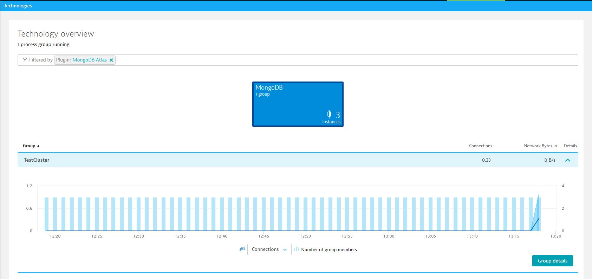
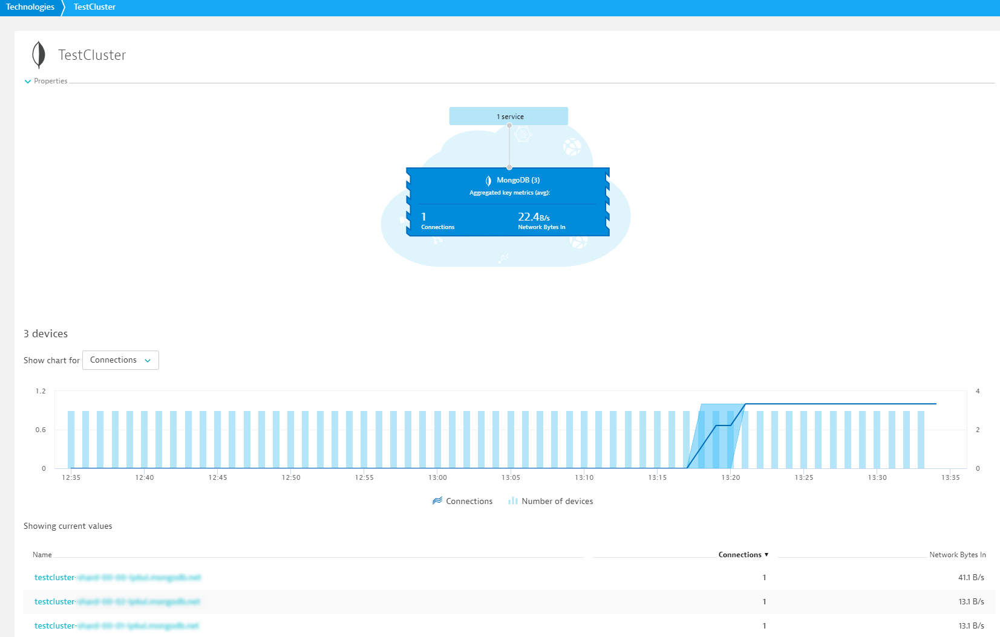
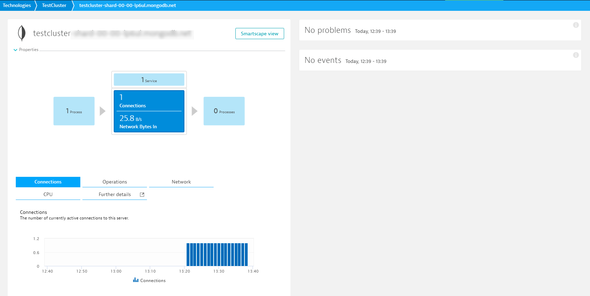

# Dynatrace ActiveGate Plugin for MongoDB Atlas

This is the home of the Dynatrace ActiveGate Plugin for MongoDB Atlas.  This plugin can be used to monitor a MongoDB instance deployed via [MongoDB Atlas](https://www.mongodb.com/cloud/atlas), where the installation of a Dynatrace OneAgent is not possible.

<br>
<br>

## About Dynatrace ActiveGate Plugins
With [ActiveGate Plugins](https://www.dynatrace.com/support/help/extend-dynatrace/activegateplugin-sdk/activegate-plugins-intro/), you can integrate Dynatrace monitoring with any remote technology that exposes an interface. You don’t need to install OneAgent. ActiveGate plugins run in ActiveGate and gather data remotely. 
With deep integration, Dynatrace can import not only other technologies’ metrics, properties, and events, but also their topologies, which can be subsequently analyzed with the Dynatrace AI! 
Along with this ability to monitor new technologies comes one of the main benefits of Dynatrace: causation between user actions, technology-specific data, transactional visibility, and more.


## Overview

The Dynatrace ActiveGate Plugin for MongoDB Atlas is a remote based plugin that runs on the Dynatrace ActiveGate.  The plugin 
systematically requests the [MongoDB Atlas API](https://docs.atlas.mongodb.com/api/) to retrieve information about the MongoDB Cluster and Nodes and the corresponding metrics.

## 1 Usage

__Requirements__:

- A MongoDB Atlas Instance

- A user created with a Read-Only access token to the MongoDB Atlas API

- Dynatrace v1.156+ (SaaS or Managed)

- Dynatrace Environment ActiveGate (1.155+) - [How to install a Dynatrace ActiveGate](https://www.dynatrace.com/support/help/shortlink/activegate-module)

- ActiveGate Server (Memory): at least 2GB

<br>

## 1.1 Deploy Dynatrace ActiveGate Plugin to the ActiveGate Server

__1.1.1 Upload plugin to ActiveGate Server__:

On your ActiveGate server, upload the **unzipped plugin** folder to the **plugin_deployment directory**:

By default on Windows: `C:\Program Files\dynatrace\remotepluginmodule\plugin_deployment`

By default on Linux: `/opt/dynatrace/remotepluginmodule/plugin_deployment`

__1.1.2 Restart Dynatrace Remote Plugin Agent__:

On Windows, restart the Service: `Dynatrace Remote Plugin Module`

On Linux, restart the Service: `remotepluginmodule`

## 1.2 Deploy Dynatrace ActiveGate Plugin to Dynatrace

In **Dynatrace UI**, go to **Settings - Monitored technologies - Custom plugins - Upload ActiveGate plugin**

Then upload the **zipped plugin** folder to Dynatrace.

__1.2.1 Configure plugin__:

```
- Enpoint name: Name of Endpoint (Can be anything)
- GroupID: Your {GROUP-ID} where you want to pull metrics.  Note: Groups and Projects are synonymous terms. 
- Username: The username that will be used to access the MongoDB ATLAS API
- Token: The generated Token used to authenticate and access the MongoDB ATLAS API
```

Read "[Configure Atlas API Access](https://docs.atlas.mongodb.com/configure-api-access/)" for more information about creating and setting up an API Access Key/Token

**Note:** Ensure that the IP Address of your ActiveGate server is added to the [IP Whitelist for Public API](https://docs.atlas.mongodb.com/configure-api-access/#provide-access-to-whitelisted-api-operations).

Example Values:

```
- Enpoint name: Cluster1
- GroupID: 5b44d73c998418951656be2b4
- Username: firstname.lastname@example.com
- Token: c12c8a7a-f6db-5dab-bd23-532fcf7fd2f8
```



<br>

## Verification
Within a few minutes after successful upload of the plugin, you should start to see the MongoDB Group in the Technologies overview within Dynatrace.



When selecting **Group details**, you will be able to see details about each node in the cluster.



When selecting a node will provide metrics about each node.

**Note:** M0 Free Tier and M2/M5 shared tier clusters may return a subset of metrics.


<br>

## Troubleshooting

Please reference the [ActiveGate troubleshooting guide](https://www.dynatrace.com/support/help/extend-dynatrace/activegateplugin-sdk/activegate-plugins-topics/troubleshooting/)

<br>

## Contributing

See [CONTRIBUTING](./CONTRIBUTING.md) for details on submitting changes.

<br>

## License

Dynatrace MongoDB Atlas ActiveGate Plugin is under Apache 2.0 license. See LICENSE for details.